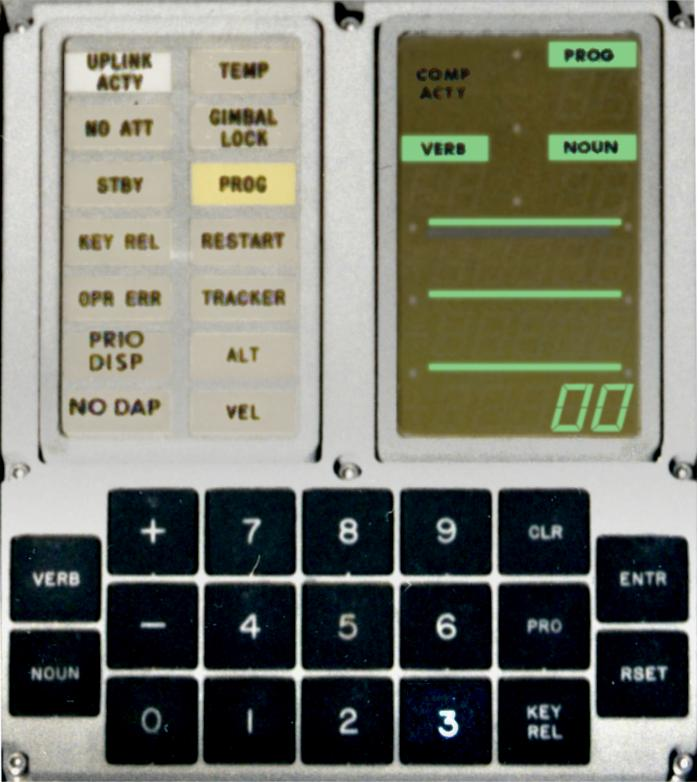

# webDSKY

webDSKY is an emulation of the so-called "DSKY" (an abbreviation of "DiSplay and KeYboard",
pronounced 'DIS-kee') user interface of the [Apollo Guidance Computer
(AGC)](https://en.wikipedia.org/wiki/Apollo_Guidance_Computer), for the [Web
Platform](https://en.wikipedia.org/wiki/Web_platform).

The goal of this project is to provide a visually and behaviorally accurate emulation
of the DSKY. It is implemented as a re-usable [Web
Component](https://developer.mozilla.org/en-US/docs/Web/Web_Components) so that it can be integrated
into other components.

The DSKY itself is just a basic input/output terminal, not a computer. It will only really 'come
to life' when connected to an [emulation of the Apollo Guidance Computer
(AGC)](https://github.com/michaelfranzl/webAGC). However, on the demo included in this project, you
can send some inputs to the DSKY and see some lights go on or off, and expect to get output events
when buttons are pushed.

Here is a screenshot of what it looks like:

The visual basis of this web component is a photograph of a real, to-be flown DSKY of the Lunar
Module of Apollo 16. The original photo is [here](https://www.hq.nasa.gov/alsj/a16/LM11-co46.jpg)
which is linked from [this page](https://www.hq.nasa.gov/alsj/a16/a16LMCloseOutPhotos.html), which
in turn is linked with the text "Pre-Launch LM Cabin Close-Out Photos" from the page [Apollo 16
Surface Journal](https://www.hq.nasa.gov/alsj/a16/a16.html). I could not find a photograph of a real
DSKY which is better suited for adaptation for this project. Using the GIMP editor I have deskewed a
cutout of the photograph to be orthogonal, adapted contrast and brightness, extracted the glass
labels (such as UPLINK ACTY or COMP ACTY) onto a [transparent layer](../LM11-co46-dsky-overlay.png),
and made the 'glass' of the warning lights semi-transparent. The shape of the 7-segment digits was
thankfully found, [documented and implemented as a font by Gene
Dorr](https://github.com/ehdorrii/dsky-fonts), even though I am not directly using his font here. I
have generated SVG paths from this font so that it is possible to toggle individual segments, which
the real DSKY supported partly, as documented by [Ronald
Burkey](https://www.ibiblio.org/apollo/developer.html#Table_of_IO_Channels). I have taken the
green-ish color value of the active electroluminiscent display from a photograph of [the DSKY
onboard the Apollo 11 CSM](https://www.hq.nasa.gov/alsj/a11/AS11-36-5388.jpg).

This implementation would not have been possible without the excellent resources on the [Virtual AGC
website](https://www.ibiblio.org/apollo).

## Note

The included images `LM11-co46*.png` are derived from [this source
image](https://www.hq.nasa.gov/alsj/a16/LM11-co46.jpg), and may, according to my layperson
understanding of copyright, constitute a 'derivative work'. However, I could not find
copyright or licensing information on [the origin
page](https://www.hq.nasa.gov/alsj/a16/a16LMCloseOutPhotos.html) of the source image, so I cannot
name the copyright owner, nor a license which is potentially attached to the image.

## Demo

See the [demo sub-directory](./demo).
